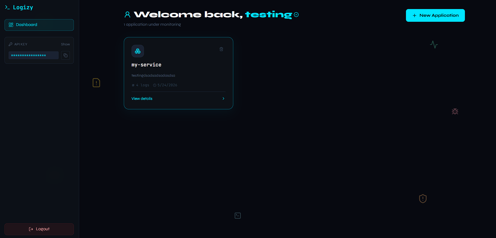
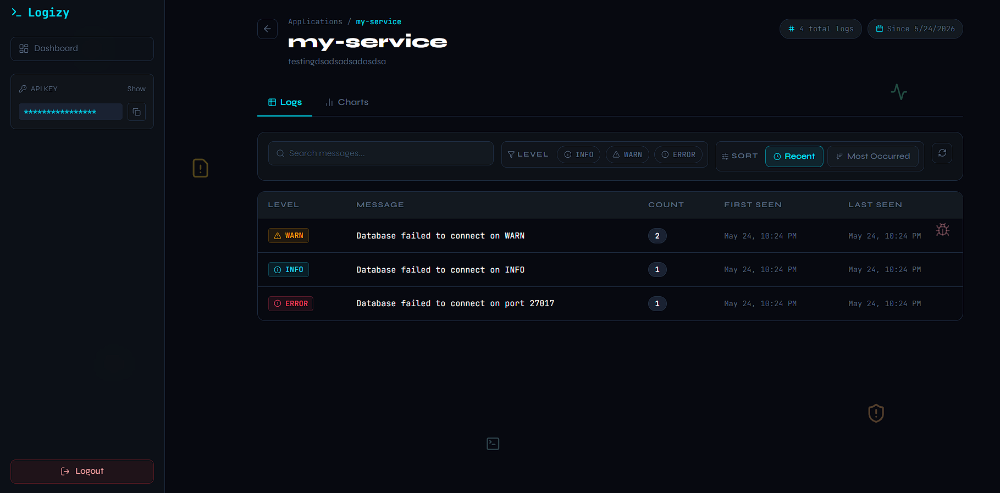
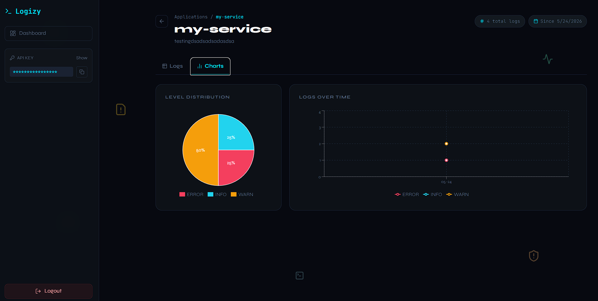
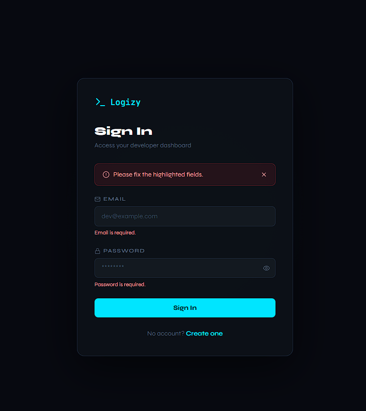
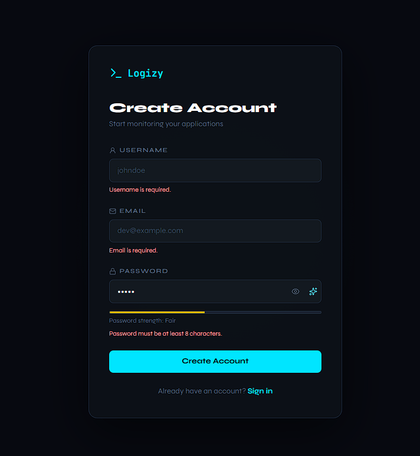

# Logizy

<p align="center">
  Developer-first logging dashboard with secure ingestion and clean observability workflows.
</p>

<p align="center">
  <a href="https://documenter.getpostman.com/view/52350176/2sBXwmPCAq#9cc73f04-c6a5-41b3-9590-4dfe59eb6665">Postman Docs</a>
  |
  <a href="#live-demo">Live Demo</a>
  |
  <a href="#screenshots">Screenshots</a>
</p>

## Overview

Logizy is a full-stack logging platform where developers can:

- create and manage monitored applications
- ingest logs from servers/services through an SDK
- explore logs using search, filtering, and sorting
- view aggregated counts and timeline-driven insights

This repository contains:

- `frontend/` -> React + Vite dashboard
- `backend/` -> Express + MongoDB API
- `sdk/logizy-server-sdk/` -> npm package `@logizy/server-sdk`

## Links

- Live Demo: https://logizy-web.vercel.app/login
- Postman API Docs: https://documenter.getpostman.com/view/52350176/2sBXwmPCAq#9cc73f04-c6a5-41b3-9590-4dfe59eb6665


## Core Features

- Cookie-based auth using httpOnly JWT session
- Application CRUD with per-user ownership checks
- Log retrieval with filtering, sorting, pagination, and message search
- Secure ingestion endpoint (`POST /api/apps/:name/logs`) via API key
- Cross-tenant protection: API key owner must match target app owner
- Deploy-ready structure for Vercel (frontend + backend split)

## Tech Stack

- Frontend: React, Vite, Zustand, Framer Motion, Recharts, Lucide
- Backend: Node.js, Express, Mongoose, JWT, CORS, cookie-parser
- Database: MongoDB
- SDK: ESM package using native `fetch` on Node.js `>= 18`

## API Endpoints

### Auth

- `POST /api/auth/signup`
- `POST /api/auth/login`
- `GET /api/auth/logout` (requires session)

### Applications (JWT session required)

- `GET /api/apps/`
- `POST /api/apps/create`
- `PUT /api/apps/update/:name`
- `GET /api/apps/get/:name`
- `DELETE /api/apps/delete/:name`

### Logs

- `GET /api/apps/:name/logs` (JWT session required for dashboard)
- `POST /api/apps/:name/logs` (API key required for ingestion)

## Postman Documentation

- API collection and examples:
  https://documenter.getpostman.com/view/52350176/2sBXwmPCAq#9cc73f04-c6a5-41b3-9590-4dfe59eb6665

## Local Development

### 1) Prerequisites

- Node.js `>= 18`
- npm
- MongoDB connection string

### 2) Install

From root:

```bash
npm install
```

From frontend:

```bash
cd frontend
npm install
```

### 3) Environment Variables

Root `.env`:

```env
PORT=5000
NODE_ENV=development
DB_URL=your_mongodb_connection_string
JWT_SECRET=your_secret
JWT_EXPIRES_IN=1d
FRONTEND_ORIGINS=http://localhost:5173
```

Frontend `.env.development`:

```env
VITE_API_URL=http://localhost:5000
```

Frontend `.env` can stay empty. In production, set `VITE_API_URL` in Vercel project settings.

### 4) Run

Backend:

```bash
npm run dev
```

Frontend (new terminal):

```bash
cd frontend
npm run dev
```

## SDK Usage

Install:

```bash
npm install @logizy/server-sdk
```

Use:

```js
import { init, log } from "@logizy/server-sdk";

init({
  apiKey: process.env.LOGIZY_API_KEY,
  appName: "my-service",
  baseUrl: "http://localhost:5000", // or deployed backend URL
});

await log({
  message: "Database timeout",
  level: "ERROR", // INFO | WARN | ERROR
});
```

## Deployment (Vercel)

Deploy as two projects:

1. `backend/`
2. `frontend/`

Deployment config already included:

- `backend/api/index.js`
- `backend/vercel.json`
- `frontend/vercel.json`
- `vercel.json` (repo-root backend deploy option)

### Backend Deploy Option A (Recommended)

- Vercel project Root Directory: `backend`
- Uses: `backend/vercel.json`

### Backend Deploy Option B (Repo Root)

- Vercel project Root Directory: `.`
- Uses: root `vercel.json` and routes all requests to `backend/api/index.js`

### Backend Env (Vercel)

- `DB_URL`
- `JWT_SECRET`
- `JWT_EXPIRES_IN`
- `NODE_ENV=production`
- `FRONTEND_ORIGINS=https://your-frontend-domain.vercel.app`

### Frontend Env (Vercel)

- `VITE_API_URL=https://your-backend-domain.vercel.app`

### SDK Release (npm, not Vercel)

The SDK lives in `sdk/logizy-server-sdk` and should be published to npm.

```bash
cd sdk/logizy-server-sdk
npm login
npm publish --access public
```

After publishing, users install it with:

```bash
npm install @logizy/server-sdk
```

## Security Notes

- JWT is not returned in login/signup response body.
- Session cookie is production-safe for split domains (`secure: true`, `sameSite: none`).
- Ingestion endpoint validates ownership to prevent cross-tenant writes.

## Scripts

Root:

- `npm run dev` -> backend dev server
- `npm start` -> backend production mode

Frontend:

- `npm run dev`
- `npm run build`
- `npm run preview`

## Screenshots

Add your UI shots to `docs/screenshots/` using the file names below.

### Dashboard



### Application Details




### Authentication



